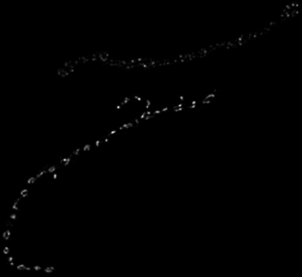

# Projective-Point-Cloud-Registration

MATLAB code for interactive registration of point clouds.

Run interactive_registration.m and select matching points
for two input images. Run interactive_registration_example.m for 
an example of how to select the points. 

#Example

![registration](example.png
